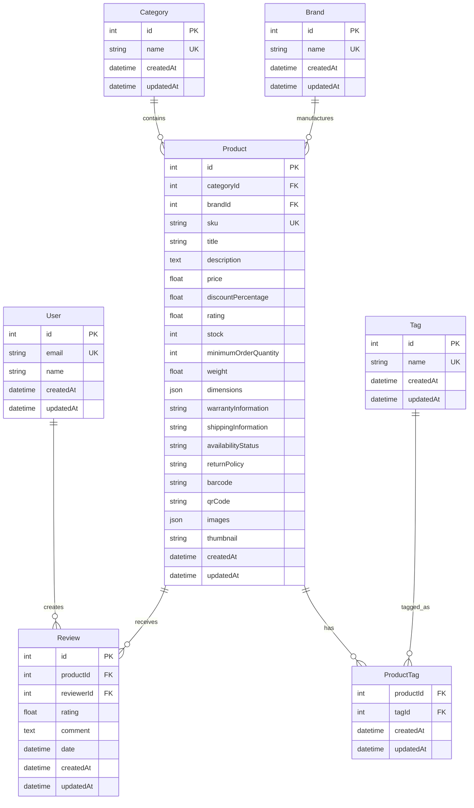

# MarketBase Monorepo

A production-ready e-commerce platform built with modern technologies and best practices. MarketBase is a complete e-commerce solution featuring product catalog management, advanced search capabilities, user reviews, and comprehensive brand/category organization.

## 🚀 Quick Start

### ⚡ One-Command Setup

Get the entire MarketBase platform running:

```bash
yarn docker:dev
```

This command automatically:
- ✅ **Builds all services** (MySQL, Elasticsearch, Kibana, Backend API, Frontend)
- ✅ **Runs database migrations** and **seeds sample data**
- ✅ **Starts all services** in correct dependency order


Note: if for some reason it did not work then do followng
```bash
docker compose up db elasticsearch
yarn workspace backend run db:migrate
yarn workspace backend run db:seed
docker compose down
---
docker compose up
```


### 🌐 Access URLs

Once started, access these services:

| Service | URL | Description |
|---------|-----|-------------|
| **Frontend** | http://localhost:3000 | E-commerce website |
| **Backend API** | http://localhost:3001 | REST API endpoints |
| **API Documentation** | http://localhost:3001/api/docs | Swagger/OpenAPI docs |
| **MySQL Database** | localhost:3306 | MySQL database (root/password) |
| **Elasticsearch** | http://localhost:9200 | Search engine API |
| **Kibana** | http://localhost:5601 | Elasticsearch management |
| **Kibana Dev Console** | http://localhost:5601/app/dev_tools#/console | Elasticsearch queries |

### 🔄 Data Migration & Seeding Commands

If you need to reset or re-seed your database:

```bash
# Stop services and clean data
yarn docker:clean

# Restart with fresh data
yarn docker:dev

# Or manually reset database (if services are running)
docker compose exec backend npm run db:reset
docker compose exec backend npm run db:seed
```

📖 **See [DEVELOPMENT.md](./DEVELOPMENT.md) for complete local development setup**

## 📋 Prerequisites

- **Docker** and **Docker Compose**
- **Node.js 20+** (for local development)
- **Yarn 4+** (package manager)

## 🏗️ Architecture

MarketBase follows a modern microservices architecture with clear separation of concerns:

```
market-base/
├── apps/
│   ├── frontend/          # Next.js 14 + TypeScript + shadcn/ui
│   └── backend/           # Express.js + TypeScript + Prisma
├── packages/
│   └── shared/            # Shared types and utilities
├── docker-compose.yml     # Full stack orchestration
└── package.json           # Workspace configuration
```

### Tech Stack

| Component | Technology | Purpose |
|-----------|------------|---------|
| **Frontend** | Next.js 14, React 18, TypeScript, Tailwind CSS, shadcn/ui | Modern e-commerce UI |
| **Backend** | Express.js, TypeScript, Prisma ORM, Swagger/OpenAPI | REST API services |
| **Database** | MySQL 8.0 | Primary data storage |
| **Search** | Elasticsearch 9.1 | Product search & analytics |
| **Analytics** | Kibana 9.1 | Data visualization & monitoring |
| **Build System** | Turborepo, Yarn Workspaces | Monorepo management |
| **DevOps** | Docker, Docker Compose | Containerization & orchestration |
| **Code Quality** | ESLint, Prettier, Husky, Commitlint | Code standards & git hooks |
| **Testing** | Jest, Testing Library | Unit & integration tests |

## 📊 Entity Relationship Diagram (ERD)



## 🔍 API Documentation

Once the backend is running, visit:
- **Swagger UI**: http://localhost:3001/api/docs
- **Health Check**: http://localhost:3001/api/health

### Complete API Endpoints

#### Health & System
```bash
GET /api/health                    # System health check
```

#### Products
```bash
GET /api/products                  # List all products with pagination
GET /api/products/:id              # Get product by ID
POST /api/products                 # Create new product
PUT /api/products/:id              # Update product
DELETE /api/products/:id           # Delete product
GET /api/products?category=beauty  # Filter by category
GET /api/products?brand=apple      # Filter by brand
GET /api/products?query=mascara    # Search products
GET /api/products?minPrice=10&maxPrice=100  # Price range filter
```

#### Categories
```bash
GET /api/categories                # List all categories
GET /api/categories/:id            # Get category by ID
POST /api/categories               # Create new category
PUT /api/categories/:id            # Update category
DELETE /api/categories/:id         # Delete category
```

#### Brands
```bash
GET /api/brands                    # List all brands
GET /api/brands/:id                # Get brand by ID
POST /api/brands                   # Create new brand
PUT /api/brands/:id                # Update brand
DELETE /api/brands/:id             # Delete brand
```

#### Tags
```bash
GET /api/tags                      # List all tags
GET /api/tags/:id                  # Get tag by ID
POST /api/tags                     # Create new tag
PUT /api/tags/:id                  # Update tag
DELETE /api/tags/:id               # Delete tag
```

#### Search & Autosuggest
```bash
GET /api/search/autosuggest?q=phone    # Get search suggestions
```

## 🌟 Features

### Frontend Features
- ✅ **Product Catalog**: Rich product listings with filtering and pagination
- ✅ **Advanced Search**: Real-time search with autocomplete suggestions
- ✅ **Product Details**: Comprehensive product information pages
- ✅ **Category Navigation**: Organized product browsing by categories
- ✅ **Brand Showcase**: Brand-specific product collections
- ✅ **Responsive Design**: Mobile-first responsive UI
- ✅ **Modern UI**: Built with shadcn/ui component library
- ✅ **Type Safety**: Full TypeScript integration
- ✅ **Performance**: Optimized loading and caching strategies

### Backend Features
- ✅ **RESTful API**: Comprehensive REST API with OpenAPI documentation
- ✅ **Database ORM**: Prisma with MySQL for robust data management
- ✅ **Search Engine**: Elasticsearch integration with fallback mechanisms
- ✅ **Data Validation**: Request/response validation with Zod schemas
- ✅ **Error Handling**: Centralized error handling with proper HTTP status codes
- ✅ **Logging**: Winston logger with multiple transports and log levels
- ✅ **Health Monitoring**: Database and service health checks
- ✅ **Rate Limiting**: API endpoint protection against abuse
- ✅ **CORS & Security**: Helmet security headers and CORS configuration
- ✅ **Testing**: Comprehensive Jest test suite with API testing

### DevOps Features
- ✅ **Containerization**: Multi-stage Docker builds for optimal image sizes
- ✅ **Orchestration**: Docker Compose for full-stack development
- ✅ **Build System**: Turborepo for efficient monorepo builds and caching
- ✅ **Code Quality**: ESLint, Prettier, Husky git hooks
- ✅ **Type Checking**: Strict TypeScript configuration across all packages
- ✅ **Hot Reload**: Development environment with live reloading
- ✅ **Environment Management**: Flexible environment configuration

## 📁 Project Structure

```
market-base/
├── apps/
│   ├── frontend/                    # Next.js E-commerce Frontend
│   │   ├── src/
│   │   │   ├── app/                # Next.js 14 App Router
│   │   │   │   ├── products/       # Product listing & detail pages
│   │   │   │   ├── search/         # Search results page
│   │   │   │   └── globals.css     # Global styles
│   │   │   ├── components/         # React components
│   │   │   │   ├── ui/            # shadcn/ui base components
│   │   │   │   ├── ProductCard.tsx # Product display component
│   │   │   │   ├── SearchBar.tsx   # Search interface
│   │   │   │   └── CategoryFilter.tsx # Category filtering
│   │   │   ├── hooks/             # Custom React hooks
│   │   │   ├── lib/               # Utilities and API client
│   │   │   └── types/             # TypeScript type definitions
│   │   ├── Dockerfile             # Production container
│   │   └── package.json
│   └── backend/                     # Express.js API Backend
│       ├── src/
│       │   ├── config/            # Configuration files
│       │   │   ├── database.ts    # Database connection
│       │   │   └── elasticsearch.ts # Search engine config
│       │   ├── controllers/       # API request handlers
│       │   │   ├── productController.ts
│       │   │   ├── categoryController.ts
│       │   │   └── brandController.ts
│       │   ├── middleware/        # Express middleware
│       │   ├── repositories/      # Data access layer
│       │   │   ├── productRepository.ts
│       │   │   └── categoryRepository.ts
│       │   ├── routes/           # API route definitions
│       │   ├── services/         # Business logic layer
│       │   │   ├── productService.ts
│       │   │   └── searchService.ts
│       │   └── __tests__/        # Test files
│       ├── prisma/               # Database schema and migrations
│       │   ├── schema.prisma     # Database models
│       │   ├── migrations/       # Database migration files
│       │   └── seed.ts          # Database seed data
│       ├── Dockerfile            # Production container
│       ├── docker-init.sh        # Container initialization script
│       └── package.json
├── packages/
│   └── shared/                      # Shared utilities and types
│       ├── src/
│       │   ├── types.ts          # Common TypeScript interfaces
│       │   ├── schemas.ts        # Zod validation schemas
│       │   └── constants.ts      # Shared constants
│       └── package.json
├── scripts/                         # Build and deployment scripts
├── docker-compose.yml              # Multi-service orchestration
├── turbo.json                      # Turborepo build configuration
├── DEVELOPMENT.md                  # Developer setup guide
└── package.json                    # Root workspace configuration
```

## 🔒 Security Features

- **Helmet**: Comprehensive security headers
- **CORS**: Configurable cross-origin resource sharing
- **Rate Limiting**: API endpoint protection with customizable limits
- **Input Validation**: Robust schema validation with Zod
- **Environment Variables**: Secure configuration management
- **SQL Injection Protection**: Prisma ORM prevents SQL injection attacks
- **Type Safety**: TypeScript ensures compile-time safety

## 📄 License

This project is licensed under the MIT License.

## 🆘 Troubleshooting

### Common Issues

**Docker services won't start**:
```bash
# Clean up Docker resources
yarn docker:clean
yarn docker:dev
```

**Database connection issues**:
```bash
# Check service status
docker compose ps
# Restart specific service
docker compose restart db
# View service logs
docker compose logs db
```

**Port conflicts**:
- Frontend (3000): Change in `apps/frontend/package.json`
- Backend (3001): Set `PORT` environment variable
- Database (3306): Change mapping in `docker-compose.yml`
- Elasticsearch (9200/9300): Update ports in `docker-compose.yml`
- Kibana (5601): Modify port mapping in `docker-compose.yml`

**Search functionality not working**:
```bash
# Check Elasticsearch health
curl http://localhost:9200/_cat/health
# Re-index products
docker compose exec backend npm run search:reindex
```

---

**MarketBase - Building the future of e-commerce! 🛒**
