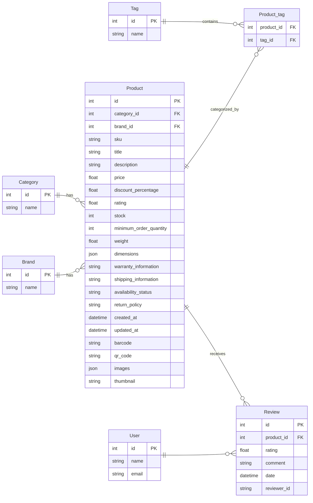

# Entity Relationship Diagram

```mermaid
---
config:
  layout: dagre
---
erDiagram
	direction LR
	Product {
		int id PK
		int category_id FK
		int brand_id FK
		string sku
		string title
		string description
		float price
		float discount_percentage
		float rating
		int stock
		int minimum_order_quantity
		float weight
		json dimensions
		string warranty_information
		string shipping_information
		string availability_status
		string return_policy
		datetime created_at
		datetime updated_at
		string barcode
		string qr_code
		json images
		string thumbnail
	}
	Category {
		int id PK
		string name
	}
	Brand {
		int id PK
		string name
	}
	Review {
		int id PK
		int product_id FK
		float rating
		string comment
		datetime date
		string reviewer_id
	}
	User {
		int id PK
		string name
		string email
	}
	Product_tag {
		int product_id FK
		int tag_id FK
	}
	Tag {
		int id PK
		string name
	}
	Category||--o{Product:"has"
	Brand||--o{Product:"has"

	Tag||--o{Product_tag:"contains"
	Product||--o{Product_tag:"categorized_by"

	Product||--o{Review:"receives"
	User||--o{Review:""
```